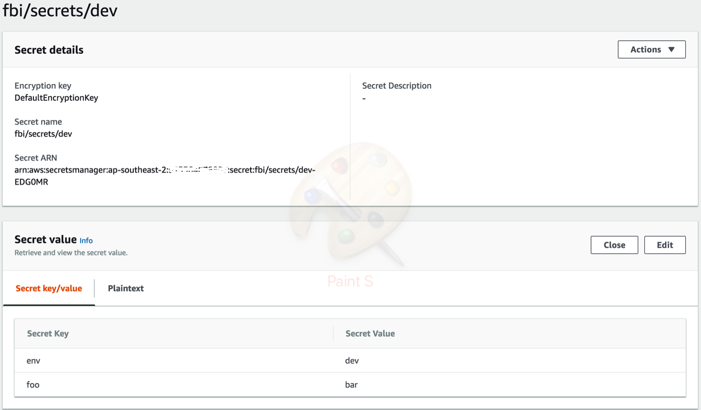

# asm-showcase
A showcase on how to get secrets with AWS Secrets manager - nodejs

### Usage

Create the secrets in aws secrets manager



Run this script to get the secrets.

```
$ TEAM=fbi PROJECT=secrets ENVIRONMENT=prod node main.js
fbi/secrets/prod
{ env: 'prod', foo: 'rab' }
rab

$ TEAM=fbi PROJECT=secrets ENVIRONMENT=dev node main.js
fbi/secrets/dev
{ env: 'dev', foo: 'bar' }
bar
```
