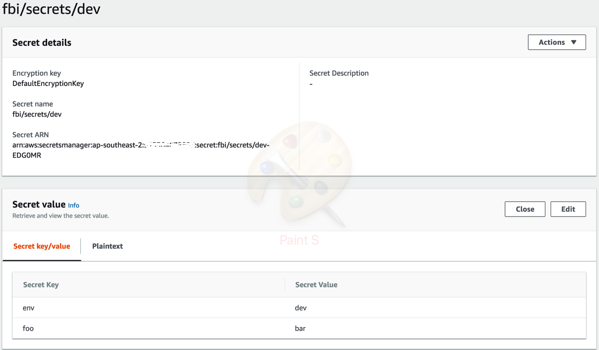

<!-- START doctoc generated TOC please keep comment here to allow auto update -->
<!-- DON'T EDIT THIS SECTION, INSTEAD RE-RUN doctoc TO UPDATE -->
**Table of Contents**

- [asm-showcase](#asm-showcase)
  - [Usage](#usage)
    - [Create the secrets in aws secrets manager console](#create-the-secrets-in-aws-secrets-manager-console)
    - [Create the secrets with aws cli](#create-the-secrets-with-aws-cli)
      - [Create secrets:](#create-secrets)
      - [Get secret:](#get-secret)
      - [Update a secret](#update-a-secret)
      - [Show current version](#show-current-version)
      - [Show previous version](#show-previous-version)
    - [Retrieve the secret in your application.](#retrieve-the-secret-in-your-application)

<!-- END doctoc generated TOC please keep comment here to allow auto update -->

# asm-showcase
A showcase on how to get secrets with AWS Secrets manager - nodejs

## Usage

### Create the secrets in aws secrets manager console



### Create the secrets with aws cli

#### Create secrets:

```
aws secretsmanager create-secret --name "fbi/secrets/dev" --secret-string file://dev.json
```

#### Get secret:
```
aws secretsmanager get-secret-value --secret-id "fbi/secrets/dev"
```

#### Update a secret 

```
# update dev.json
$ aws secretsmanager put-secret-value --secret-id "fbi/secrets/dev" --secret-string file://dev.json |jq -r .SecretString
```

#### Show current version
```
$ aws secretsmanager get-secret-value --secret-id "fbi/secrets/dev" --version-stage AWSCURRENT |jq -r .SecretString
```
#### Show previous version
```
$ aws secretsmanager get-secret-value --secret-id "fbi/secrets/dev" --version-stage AWSPREVIOUS |jq -r .SecretString
```

### Retrieve the secret in your application.

```
$ npm install

$ TEAM=fbi PROJECT=secrets ENVIRONMENT=prod node main.js
fbi/secrets/prod
{ env: 'prod', foo: 'rab' }
rab

$ TEAM=fbi PROJECT=secrets ENVIRONMENT=dev node main.js
fbi/secrets/dev
{ env: 'dev', foo: 'bar' }
bar
```
